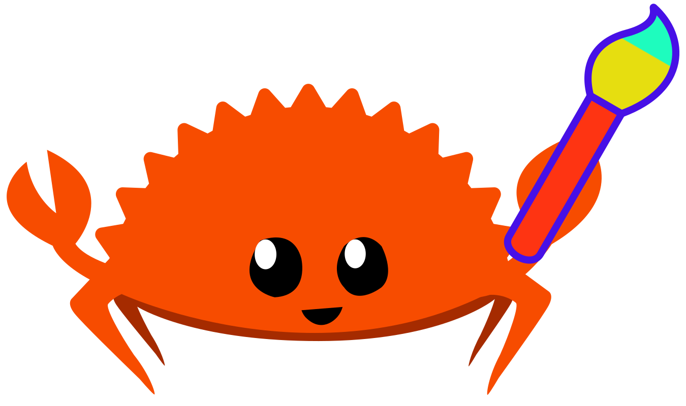

# mgart

Machine Generated Art. `mgart` (pronounced "em-gart") is a rust crate and
CLI application you can use to generate art from input parameters you
provide.
While currently far, far away, the goal for `mgart` is to develop an 
easy-to-use yet powerful declarative DSL you can use to create
beautiful images in WYSIWYW (What You See Is What You Want) fashion.
