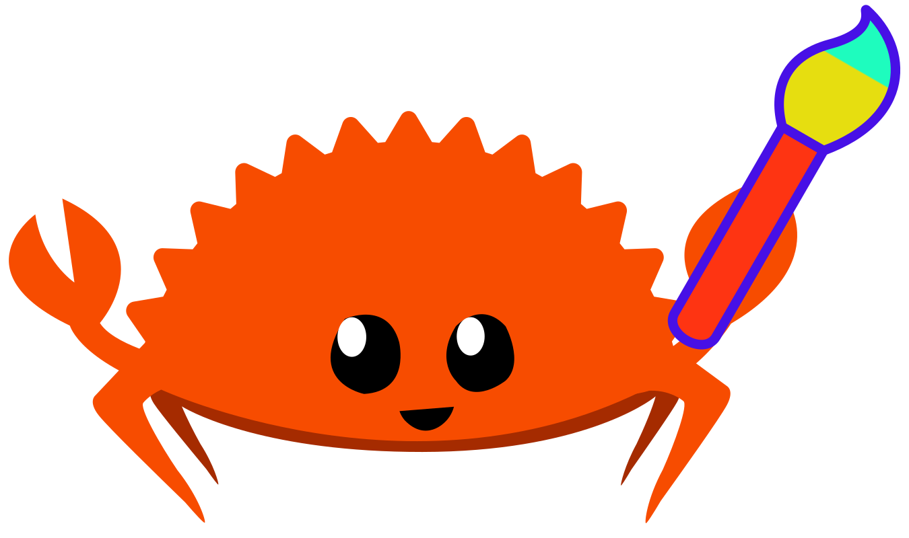
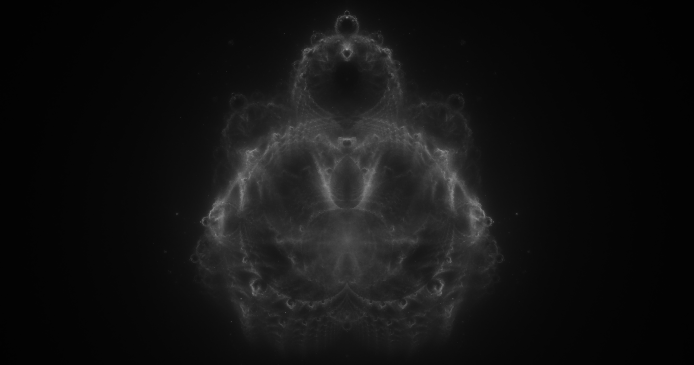

# Mgart

[](https://github.com/jofas/mgart/actions/workflows/build.yml)
[](https://codecov.io/gh/jofas/mgart)
[](https://crates.io/crates/mgart)
[](https://crates.io/crates/mgart)
[](https://docs.rs/mgart/latest/mgart)
[](https://opensource.org/licenses/MIT)
[](CODE_OF_CONDUCT.md) 


**M**achine **G**enerated **Art**, short Mgart and pronounced 
"em-gart" is a rust crate and CLI application for generating 
algorithmic art.

## Table of contents

<!--ts-->
   * [Install](#install)
      * [Cargo](#cargo)
      * [From source](#from-source)
   * [Example](#example)
   * [Supported Algorithms](#supported-algorithms)
      * [Fractals](#fractals)
         * [Mandelbrot and Julia Sets](#mandelbrot-and-julia-sets)
         * [Buddhabrot](#buddhabrot)
         * [Other](#other)
      * [AI Art](#ai-art)
   * [Contributing](#contributing)
   * [License](#license)
<!--te-->

## Install

### Cargo

Note that you need to have the rust toolchain installed on your
computer if you want to install Mgart using `cargo`.

Mgart is distributed via [crates.io](https://crates.io) and can be 
installed with:

```bash
cargo install mgart
```

If you'd like to install a specific version of Mgart, use the
`--version` flag:

```bash
cargo install --version $VERSION
```

If you have an old version of Mgart already installed and wish to 
update it to the newest version, use the `--force` flag:

```bash
cargo install --force mgart
```

Check that Mgart is successfully installed by running:

```bash
mgart -V
```

This should print `mgart`, followed by the version you have installed.


### From source

For development or if you would like to work with the latest, unstable
version, you can install Mgart from source. 
Note that you need to have the rust toolchain installed on your 
computer, if you want to build Mgart from source.

First, clone the Mgart repository and enter it:

```bash
git clone https://github.com/jofas/mgart && cd mgart
```

If you want to work inside this directory, potentially because you
wish to contribute to Mgart, you can execute the CLI application
like this:

```bash
cargo run --release -- $FILE
```

`$FILE` being the path to the file containing your algorithms (see the
[Example](#example) section).
Note that adding the `--release` flag to the command significantly
enhances the execution speed.

You can also install Mgart from source, rather than just working from
the source directory.
Do so by running the following command in the Mgart source directory:

```bash
cargo install --path .
```

This will compile Mgart and make the program available for your user 
to execute.
Check installation by running:

```
mgart -V
```


## Example

If you run `mgart -h`, you will find that Mgart takes a single file as
input argument.
The content of the file contains the configuration for the art
pieces you wish to generate.
Currently, Mgart supports Json and [Jsonnet](https://jsonnet.org/) 
input files.
The input file contains an array of `algorithm` objects where each one
describes an artwork you would like to create.
This is an example Json file that would generate a single artwork, a 
rendering of a [buddhabrot](https://en.wikipedia.org/wiki/Buddhabrot):

```json
[
   {
      "algorithm": "buddhabrot",
      "filename": "buddhabrot_20000.png",
      "width": 3800,
      "height": 2000,
      "center": {
         "im": -0.35,
         "re": 0
      },
      "zoom": 0.45,
      "exponent": 2,
      "iter": 20000,
      "rotation": 90,
      "sample_count": 500000000,
      "sampler": {
         "r": 3,
         "type": "uniform_polar"
      },
      "post_processing": [
         {
            "process": "normalize"
         },
         {
            "bin_count": 256,
            "contrast_limit": 500,
            "process": "clahe",
            "tile_size_x": 380,
            "tile_size_y": 200
         },
         {
            "h": 0.0005,
            "n": 7,
            "process": "smoothing",
            "type": "non_local_means",
            "window_size": 21
         }
      ],
      "color_map": {
         "gradient": {
            "factor": 1,
            "type": "linear"
         },
         "map": [
            {
               "b": 0,
               "g": 0,
               "r": 0,
               "type": "rgb"
            },
            {
               "b": 255,
               "g": 255,
               "r": 255,
               "type": "rgb"
            }
         ]
      }
   }
]
```

You simply run `mgart $FILE` and Mgart does the rest for you.
The resulting image looks like:



You can find more example artworks and their configuration in the 
`examples/` folder.


## Supported Algorithms

Below you will find a list of algorithms either already supported by
Mgart or planned to be supported in a future release.

### Fractals

Algorithms for creating various types of fractal art.

#### Mandelbrot and Julia Sets

#### Buddhabrot

* [x] Buddhabrot

* [ ] Anti-Buddhabrot

* [ ] Nebulabrot

#### Other

* [ ] Fractal Flames

* [ ] Newton Fractals

* [ ] Strange Attractors

* [ ] L-Systems

### AI Art

* [ ] DeepDream-like filter

* [ ] Text-to-image


## Contributing

Contributions are very welcome! See [CONTRIBUTING](CONTRIBUTING.md)
for details.
When you contribute, make sure to follow the 
[Contributor Covenant v2.1](CODE_OF_CONDUCT.md).


## License

Mgart is licensed under the MIT license.
See [LICENSE](LICENSE) for details.
